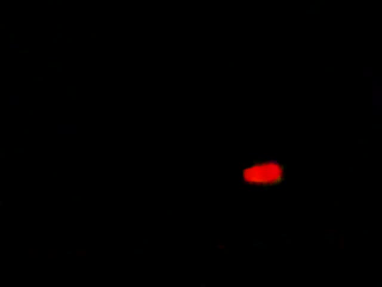
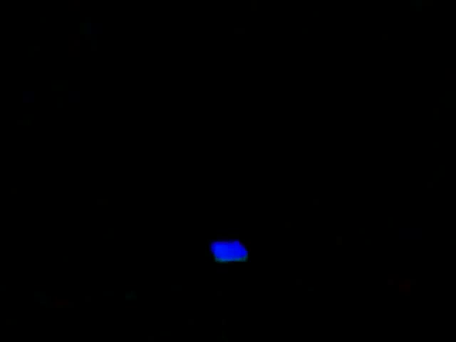
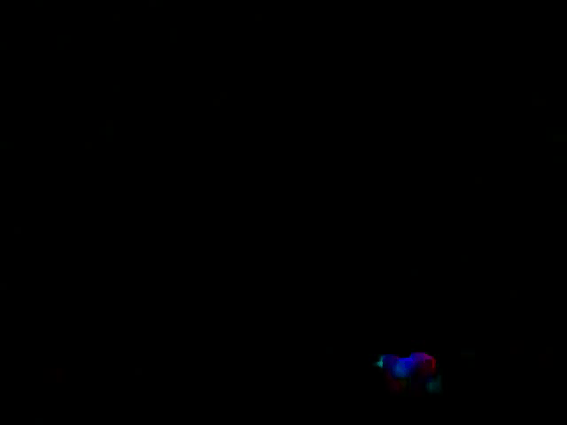
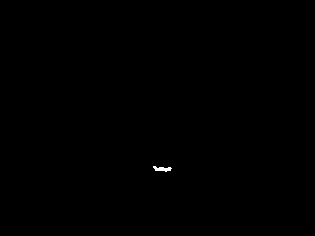
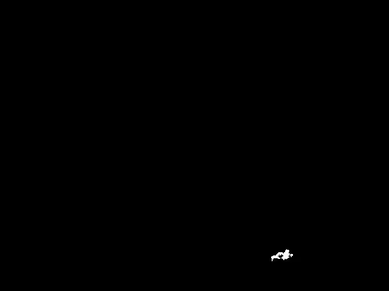
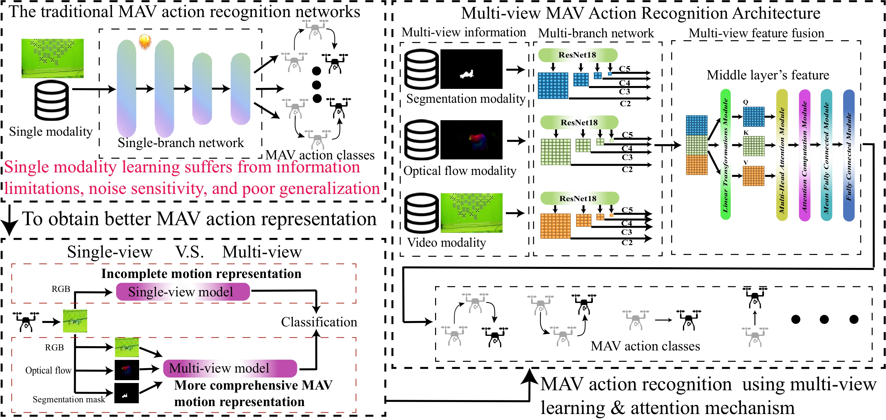
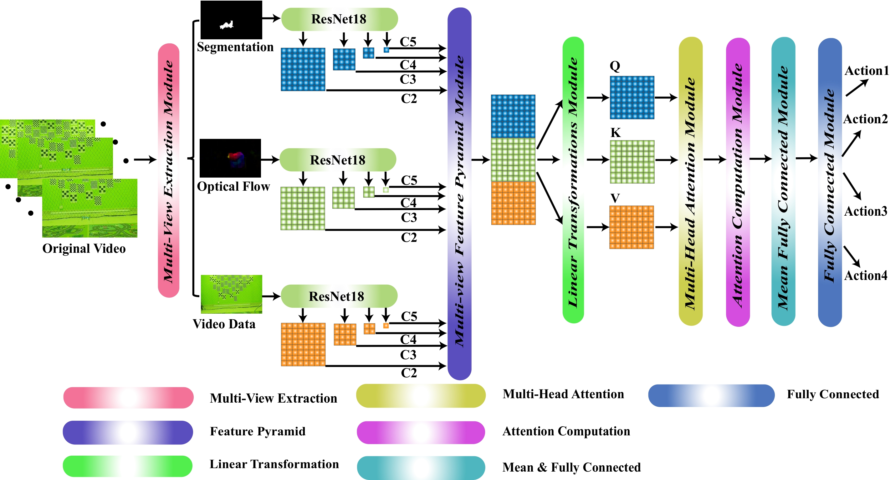

# MAVR-Net: Robust Multi-View Learning for MAV Action Recognition with Cross-View Attention

## Authors： Nengbo Zhang  and Ho Hann Woei

## Abstract:

Recognizing the motion of Micro Aerial Vehicles (MAVs) is crucial for enabling cooperative perception and control in 
autonomous aerial swarms. Yet, vision-based recognition models relying only on RGB data often fail to capture the
 complex spatial–temporal characteristics of MAV motion, which limits their ability to distinguish different actions. 
 To overcome this problem, this paper presents MAVR-Net, a multi-view learning-based MAV action recognition framework. 
 Unlike traditional single-view methods, the proposed approach combines three complementary types of data, including 
 raw RGB frames, optical flow, and segmentation masks, to improve the robustness and accuracy of MAV motion recognition.
 Specifically, ResNet-based encoders are used to extract discriminative features from each view, and a multi-scale feature 
 pyramid is adopted to preserve the spatiotemporal details of MAV motion patterns. To enhance the interaction between 
 different views, a cross-view attention module is introduced to model the dependencies among various modalities and feature
 scales. In addition, a multi-view alignment loss is designed to ensure semantic consistency and strengthen cross-view feature 
 representations. Experimental results on benchmark MAV action datasets show that our method clearly outperforms existing approaches,
 achieving $97.8\%$, $96.5\%$, and $92.8\%$ accuracy on the Short MAV, Medium MAV, and Long MAV datasets, respectively.

## Four Action:

## RGB Action: 

### vShape action:


### up_down action:


### left_right action:


### inv_vShape action:


## Opticl Flow Action: 

### vShape action:



### up_down action:


### left_right action:




### inv_vShape action:




## Segmentation Action: 

### vShape action:


### up_down action:


### left_right action:




### inv_vShape action:




## Research Motivation:



 
## Method:



## Datasets link:

The part of validate datasets is in following: https://drive.google.com/file/d/1DfgWLfLJ0zHUOGUXlXQdDfDa8Ml0Z2aZ/view?usp=sharing We will release full data after the paper accept.


# Citation
If you use the dataset and codes in an academic context, please cite our work:
````
Nengbo Zhang, Hann Woei Ho*, MAVR-Net: Robust Multi-View Learning for MAV Action Recognition with Cross-View Attention.
(The academic paper was submitted to International Journal of Intelligent Robotics and Applications)
````
